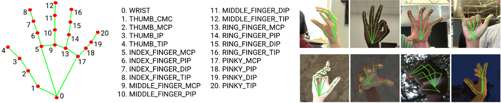
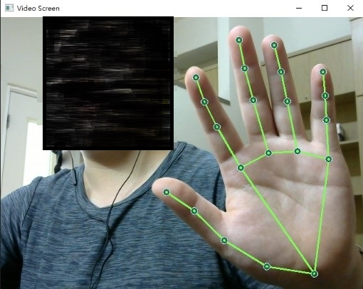
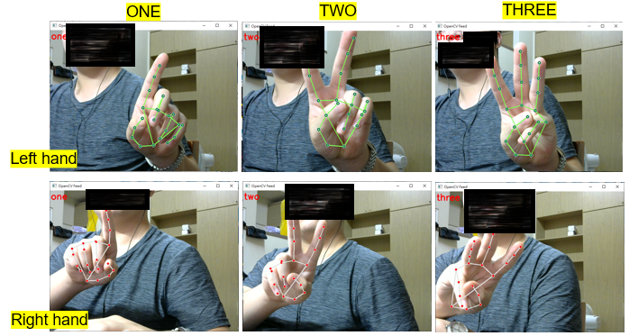

# Gesture_Recognition
* This code mainly wants to train a Skeleton-based recognition model and apply it on Raspberry Pi.
* I chose simple gesture recognition as an example.

## MediaPipe
* An open-source framework developed by Google Research and proposed in June 2019 for building multimedia machine-learning applications.

## Environment
```shell
  conda create –n gesture python=3.8.11
  conda activate gesture
```
## Dependencies
```shell
  pip install tensorflow==2.3.0
  pip install tensorflow-gpu==2.3.0
  pip install opencv-python
  pip install mediapipe
  pip install sklearn
  pip install matplotlib
```
## Making libraries code
1. draw_keypoints.py:
    * Related settings for joint point drawing.
    * Connect the joint points and draw them on the image so that the joint points can be displayed in real-time.
3. get_keypoints.py:
    * Extract the joint points of the left and right hands and bring them together.
    * The hand joint points will return x, y, and z coordinates, and a hand will have 21 joint points.
    * Therefore, to ensure that the length of the input to the neural network is fixed, the joint points of the left and right hands will be concatenated. If no hand image is detected in the image, zero-filling will be performed.
5. mediapipe_tool.py:
    * Image joint point prediction.
   
## Codes:
### keypointDemo.py
* Check whether the joint point really can detect or not.

```shell
  python keypointDemo.py
```
### keypoint_label.py
* Collect gesture joint point database.
```shell
  python keypoint_label.py
```
### gesture.ipynb
* Trained the gesture recognition model on Google Colab.

### gesture_recognition.py
* Real-time gesture recognition
```shell
  python gesture_recognition.py
```



